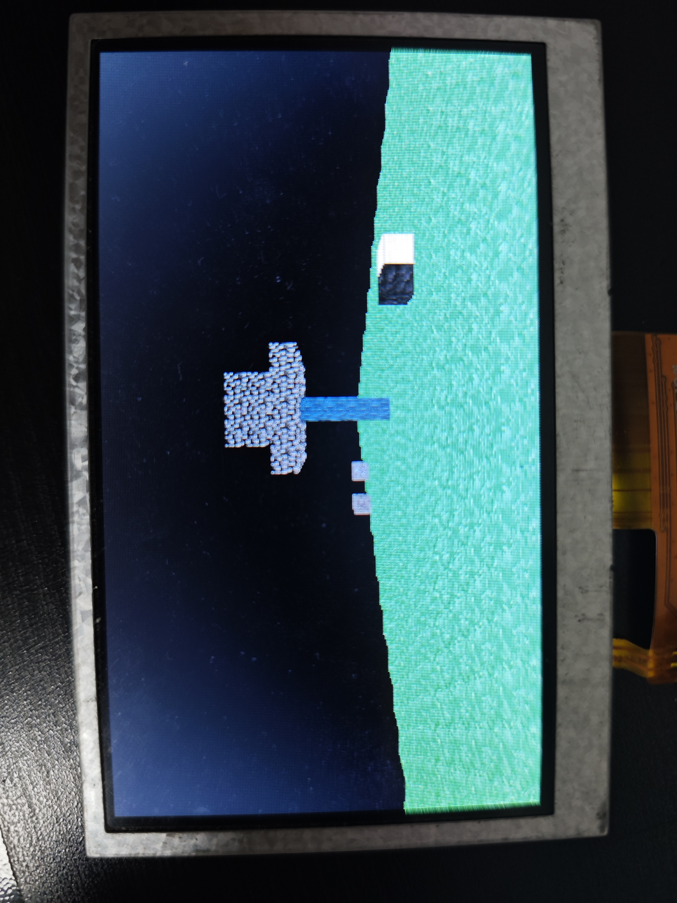

**English | [简体中文](README_cn.md)**
<div id="top"></div>

[![Contributors][contributors-shield]][contributors-url]
[![Forks][forks-shield]][forks-url]
[![Stargazers][stars-shield]][stars-url]
[![Issues][issues-shield]][issues-url]
[![License][license-shield]][license-url]


<!-- PROJECT LOGO -->
<br />
<div align="center">
    <a href="https://github.com/MoonGrt/FPGA-Minecraft">
    
    </a>
<h3 align="center">FPGA-Minecraft</h3>
    <p align="center">
    This FPGA project involves the development of a Minecraft game entirely in hardware. The game enables players to place and break blocks, move, and fly. It utilizes a rendering pipeline to calculate the color of each pixel, ultimately displaying the generated frames on an HDMI screen. This hardware-based approach ensures efficient real-time rendering and interaction within the game environment.
    <br />
    <a href="https://github.com/MoonGrt/FPGA-Minecraft"><strong>Explore the docs »</strong></a>
    <br />
    <a href="https://github.com/MoonGrt/FPGA-Minecraft">View Demo</a>
    ·
    <a href="https://github.com/MoonGrt/FPGA-Minecraft/issues">Report Bug</a>
    ·
    <a href="https://github.com/MoonGrt/FPGA-Minecraft/issues">Request Feature</a>
    </p>
</div>


<!-- CONTENTS -->
<details open>
  <summary>This FPGA project involves the development of a Minecraft game entirely in hardware. The game enables players to place and break blocks, move, and fly. </summary>
  <ol>
    <li><a href="#file-tree">File Tree</a></li>
    <li>
      <a href="#about-the-project">About The Project</a>
      <ul>
      </ul>
    </li>
    <li><a href="#contributing">Contributing</a></li>
    <li><a href="#license">License</a></li>
    <li><a href="#contact">Contact</a></li>
    <li><a href="#acknowledgments">Acknowledgments</a></li>
  </ol>
</details>


<!-- FILE TREE -->
## File Tree

```
└─ Project
  ├─ LICENSE
  ├─ README.md
  ├─ /Algorithm/
  │ ├─ sight_line.m
  │ └─ /GUI/
  │   └─ sight_line.mlapp
  ├─ /Document/
  ├─ /Project/
  │ ├─ /minecraft/
  │ │ ├─ top.gprj
  │ │ └─ top.gprj.user
  │ └─ /minecraft_moon/
  │   ├─ minecraft_moon.xpr
  │   ├─ minecraft_moon1.zip
  │   └─ /minecraft_moon.srcs/
  │     ├─ /sim_1/
  │     │ ├─ tb_sort.v
  │     │ └─ tb_top.v
  │     └─ /sources_1/
  └─ /Tool/
    ├─ CircleMapping.py
    ├─ coe_to_mi.py
    ├─ map_gen.py
    ├─ output.mi
    ├─ png_to_mi.py
    └─ xy_map.mi

```


<!-- ABOUT THE PROJECT -->
## About The Project



> 50MHz Riscv SoC, render once about 5s.


> Hardware rendering pipeline, about 2fps.

This FPGA project involves the development of a Minecraft game entirely in hardware. The game enables players to place and break blocks, move, and fly. It utilizes a rendering pipeline to calculate the color of each pixel, ultimately displaying the generated frames on an HDMI screen. This hardware-based approach ensures efficient real-time rendering and interaction within the game environment.

<p style=" margin-top:0px; margin-bottom:0px; margin-left:0px; margin-right:0px; -qt-block-indent:0; text-indent:0px;">

<p align="right">(<a href="#top">top</a>)</p>


<!-- CONTRIBUTING -->
## Contributing

Contributions are what make the open source community such an amazing place to learn, inspire, and create. Any contributions you make are **greatly appreciated**.
If you have a suggestion that would make this better, please fork the repo and create a pull request. You can also simply open an issue with the tag "enhancement".
Don't forget to give the project a star! Thanks again!
1. Fork the Project
2. Create your Feature Branch (`git checkout -b feature/AmazingFeature`)
3. Commit your Changes (`git commit -m 'Add some AmazingFeature'`)
4. Push to the Branch (`git push origin feature/AmazingFeature`)
5. Open a Pull Request
<p align="right">(<a href="#top">top</a>)</p>


<!-- LICENSE -->
## License

Distributed under the MIT License. See `LICENSE` for more information.
<p align="right">(<a href="#top">top</a>)</p>


<!-- CONTACT -->
## Contact

MoonGrt - 1561145394@qq.com
Project Link: [MoonGrt](https://github.com/MoonGrt/)
<p align="right">(<a href="#top">top</a>)</p>


<!-- ACKNOWLEDGMENTS -->
## Acknowledgments

* [Choose an Open Source License](https://choosealicense.com)
* [GitHub Emoji Cheat Sheet](https://www.webpagefx.com/tools/emoji-cheat-sheet)
* [Malven's Flexbox Cheatsheet](https://flexbox.malven.co/)
* [Malven's Grid Cheatsheet](https://grid.malven.co/)
* [Img Shields](https://shields.io)
* [GitHub Pages](https://pages.github.com)
* [Font Awesome](https://fontawesome.com)
* [React Icons](https://react-icons.github.io/react-icons/search)
<p align="right">(<a href="#top">top</a>)</p>


<!-- MARKDOWN LINKS & IMAGES -->
<!-- https://www.markdownguide.org/basic-syntax/#reference-style-links -->
[contributors-shield]: https://img.shields.io/github/contributors/MoonGrt/FPGA-Minecraft.svg?style=for-the-badge
[contributors-url]: https://github.com/MoonGrt/FPGA-Minecraft/graphs/contributors
[forks-shield]: https://img.shields.io/github/forks/MoonGrt/FPGA-Minecraft.svg?style=for-the-badge
[forks-url]: https://github.com/MoonGrt/FPGA-Minecraft/network/members
[stars-shield]: https://img.shields.io/github/stars/MoonGrt/FPGA-Minecraft.svg?style=for-the-badge
[stars-url]: https://github.com/MoonGrt/FPGA-Minecraft/stargazers
[issues-shield]: https://img.shields.io/github/issues/MoonGrt/FPGA-Minecraft.svg?style=for-the-badge
[issues-url]: https://github.com/MoonGrt/FPGA-Minecraft/issues
[license-shield]: https://img.shields.io/github/license/MoonGrt/FPGA-Minecraft.svg?style=for-the-badge
[license-url]: https://github.com/MoonGrt/FPGA-Minecraft/blob/master/LICENSE

