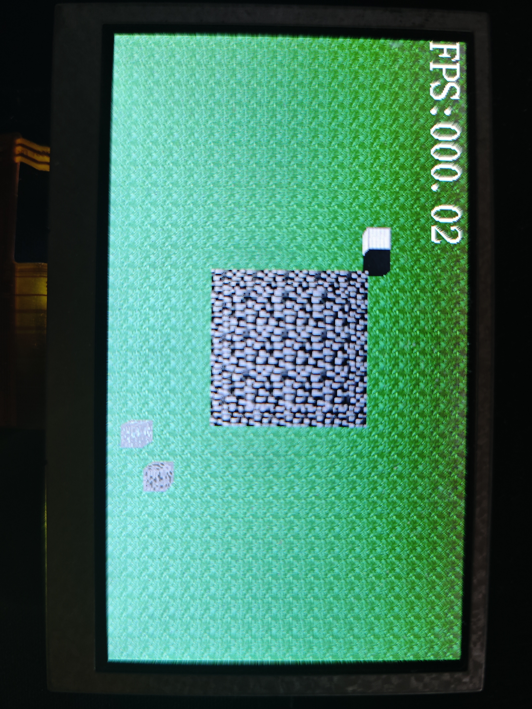
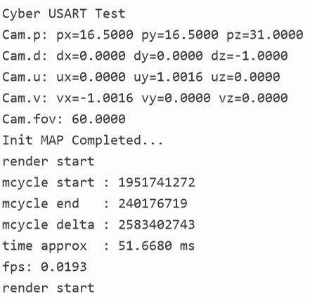
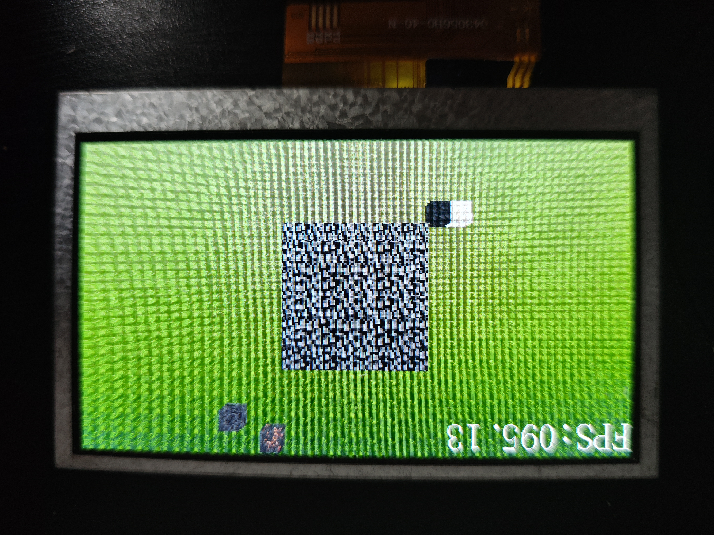
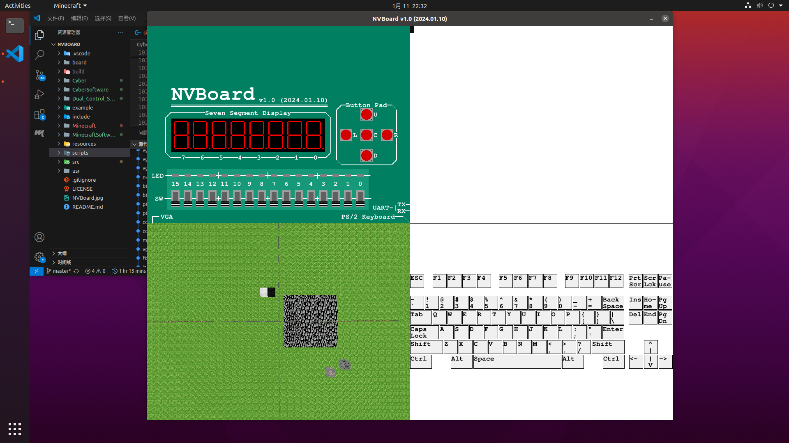

**简体中文 | [English](README.md)**
<div id="top"></div>

[![Contributors][contributors-shield]][contributors-url]
[![Forks][forks-shield]][forks-url]
[![Stargazers][stars-shield]][stars-url]
[![Issues][issues-shield]][issues-url]
[![License][license-shield]][license-url]


<!-- PROJECT LOGO -->
<br />
<div align="center">
    <a href="https://github.com/MoonGrt/Minecraft">
    
    </a>
<h3 align="center">Minecraft</h3>
    <p align="center">
    该FPGA项目旨在完全通过硬件实现《我的世界》游戏。玩家可在游戏中放置与破坏方块、移动及飞行。
    <br />
    <a href="https://github.com/MoonGrt/Minecraft"><strong>浏览文档 »</strong></a>
    <br />
    <a href="https://github.com/MoonGrt/Minecraft">查看 Demo</a>
    ·
    <a href="https://github.com/MoonGrt/Minecraft/issues">反馈 Bug</a>
    ·
    <a href="https://github.com/MoonGrt/Minecraft/issues">请求新功能</a>
    </p>
</div>


<!-- CONTENTS -->
<details open>
  <summary>目录</summary>
  <ol>
    <li><a href="#文件树">文件树</a></li>
    <li>
      <a href="#关于本项目">关于本项目</a>
      <ul>
      </ul>
    </li>
    <li><a href="#贡献">贡献</a></li>
    <li><a href="#许可证">许可证</a></li>
    <li><a href="#联系我们">联系我们</a></li>
    <li><a href="#致谢">致谢</a></li>
  </ol>
</details>


<!-- 文件树 -->
## 文件树

```
└─ Project
  ├─ LICENSE
  ├─ README.md
  ├─ README_cn.md
  ├─ /Algorithm/
  │ ├─ sight_line.m
  │ └─ /GUI/
  │   └─ sight_line.mlapp
  ├─ /Document/
  ├─ /hardware/
  │ ├─ readme.md
  │ ├─ /NvBoard/
  │ │ └─ readme.md
  │ ├─ /tang_primer/
  │ │ ├─ top.gprj
  │ │ └─ /src/
  │ └─ /Zynq7020-BX71/
  ├─ /scripts/
  └─ /software/
    ├─ readme.md
    ├─ /minecraft/
    ├─ /riscv/
    │ ├─ top.gprj
    │ └─ /src/
    └─ /simulation/
      ├─ /c/
      │ └─ minecraft.c
      └─ /python/
        └─ minecraft.py

```


<!-- 关于本项目 -->
## 关于本项目




> 50MHz RISC-V SoC，渲染一次（480×272）耗时约51秒——0.0193帧/秒。



> 硬件渲染管道（54MHz），约95.13帧/秒。



> 虚拟FPGA板（NvBoard）渲染管道。低频率导致帧率低下——5.29帧/秒。

该FPGA项目旨在完全通过硬件实现《我的世界》游戏。玩家可在游戏中放置与破坏方块、移动及飞行。系统通过渲染管道计算每个像素的颜色，最终将生成的帧显示在HDMI屏幕上。

<p style=" margin-top:0px; margin-bottom:0px; margin-left:0px; margin-right:0px; -qt-block-indent:0; text-indent:0px;">

<p align="right">(<a href="#top">top</a>)</p>


<!-- 路线图 -->
## 路线图

- [ ] Ray Tracing
  - Software:
    - PC-C simulation; Visualization of ray tracings in MATLAB;
    - Software rendering on an RISC-V SoC running on an FPGA
  - Hardware: Bresenham's Line Algorithm
    - Gowin FPGA implementation
    - TODO: NvBoard implementation
- [ ] Rasterization
  - TODO:

到 [open issues](https://github.com/MoonGrt/Minecraft/issues) 页查看所有请求的功能 （以及已知的问题）。

<p align="right">(<a href="#top">顶部</a>)</p>


<!-- 贡献 -->
## 贡献

贡献让开源社区成为了一个非常适合学习、互相激励和创新的地方。你所做出的任何贡献都是**受人尊敬**的。

如果你有好的建议，请复刻（fork）本仓库并且创建一个拉取请求（pull request）。你也可以简单地创建一个议题（issue），并且添加标签「enhancement」。不要忘记给项目点一个 star！再次感谢！

1. 复刻（Fork）本项目
2. 创建你的 Feature 分支 (`git checkout -b feature/AmazingFeature`)
3. 提交你的变更 (`git commit -m 'Add some AmazingFeature'`)
4. 推送到该分支 (`git push origin feature/AmazingFeature`)
5. 创建一个拉取请求（Pull Request）
<p align="right">(<a href="#top">top</a>)</p>


<!-- 许可证 -->
## 许可证

根据 MIT 许可证分发。打开 [LICENSE](LICENSE) 查看更多内容。
<p align="right">(<a href="#top">top</a>)</p>


<!-- 联系我们 -->
## 联系我们

MoonGrt - 1561145394@qq.com
Project Link: [MoonGrt/Minecraft](https://github.com/MoonGrt/Minecraft)

<p align="right">(<a href="#top">top</a>)</p>


<!-- 致谢 -->
## 致谢

* [Choose an Open Source License](https://choosealicense.com)
* [GitHub Emoji Cheat Sheet](https://www.webpagefx.com/tools/emoji-cheat-sheet)
* [Malven's Flexbox Cheatsheet](https://flexbox.malven.co/)
* [Malven's Grid Cheatsheet](https://grid.malven.co/)
* [Img Shields](https://shields.io)
* [GitHub Pages](https://pages.github.com)
* [Font Awesome](https://fontawesome.com)
* [React Icons](https://react-icons.github.io/react-icons/search)
<p align="right">(<a href="#top">top</a>)</p>


<!-- MARKDOWN LINKS & IMAGES -->
<!-- https://www.markdownguide.org/basic-syntax/#reference-style-links -->
[contributors-shield]: https://img.shields.io/github/contributors/MoonGrt/Minecraft.svg?style=for-the-badge
[contributors-url]: https://github.com/MoonGrt/Minecraft/graphs/contributors
[forks-shield]: https://img.shields.io/github/forks/MoonGrt/Minecraft.svg?style=for-the-badge
[forks-url]: https://github.com/MoonGrt/Minecraft/network/members
[stars-shield]: https://img.shields.io/github/stars/MoonGrt/Minecraft.svg?style=for-the-badge
[stars-url]: https://github.com/MoonGrt/Minecraft/stargazers
[issues-shield]: https://img.shields.io/github/issues/MoonGrt/Minecraft.svg?style=for-the-badge
[issues-url]: https://github.com/MoonGrt/Minecraft/issues
[license-shield]: https://img.shields.io/github/license/MoonGrt/Minecraft.svg?style=for-the-badge
[license-url]: https://github.com/MoonGrt/Minecraft/blob/master/LICENSE

